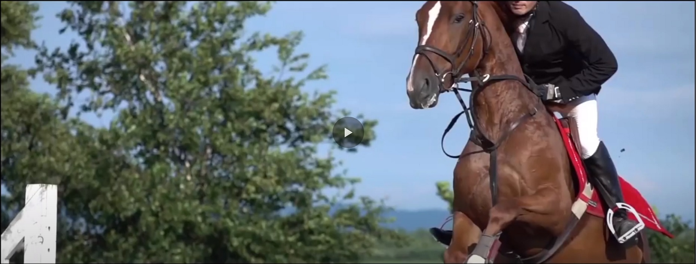

# Deep-SloMo [](https://opensource.org/licenses/mit-license.php)
Official PyTorch implementation of "Deep Slow Motion Video Reconstruction with Hybrid Imaging System" [Project](http://faculty.cs.tamu.edu/nimak/Papers/ICCP2020_Slomo) | [Paper](https://arxiv.org/abs/2002.12106)  
IEEE Transactions on Pattern Analysis and Machine Intelligence (TPAMI) and ICCP 2020.  

This project is an appliaction of Computational Photography to enhance the slow motion video capturing capabilities of cameras by leveraging [dual camera setups](#our-real-camera-rigs).  

Example: If a dual camera smartphone is capable of capturing 240fps at 480p and 30fps at 1080p, we can generate 240fps 1080p videos by simultaneously utilizing both cameras.


## Prerequisites
This codebase was developed and tested with PyTorch 1.3.1, CUDA 0.4.2 and Python 3.7.5.  

### Installation
```bash
conda install pytorch==1.3.1 torchvision==0.4.2 cudatoolkit=10.1 numpy -c pytorch
pip install tqdm
```
Download repository
```bash
https://github.com/avinashpaliwal/Deep-SloMo.git
```
Build correlation package for [PWCNet](https://github.com/NVlabs/PWC-Net/tree/master/PyTorch/external_packages/correlation-pytorch-master)
```bash
$ cd PWCNet/correlation_package_pytorch1_0
$ ./build.sh
```

## Test
### Pretrained model
The pretrained model checkpoints are in the [Checkpoints folder](Checkpoints).

### Scenes
You can download the synthetic (<span style="font-variant:small-caps;">Juggler and Horse</span>), real digital camera (<span style="font-variant:small-caps;">Basketball, Fountain and Veggies</span>) and smartphone (<span style="font-variant:small-caps;">Jump, Dribble and Car</span>) scenes [here](https://drive.google.com/drive/folders/1ezabQM14Xq4d9cZYp8jbnoWvnPX0uCsA?usp=sharing).  

### Synthetic scenes
```bash
python test.py --scene_root path/to/juggler --interpolation_sequence 12
```
### Digital camera scenes
```bash
python test.py --scene_root path/to/basketball --interpolation_sequence 13 12 12
```
### Smartphone scenes
```bash
python test.py --scene_root path/to/jump --interpolation_sequence 3
```
The `--interpolation_sequence` depends on the low and high frame rates. Example: For 30 and 400 fps, since they are not divisible, the sequence is `13 12 12`.  
The `--scene_root` is path to the scene folder containing low-res `LR` and high-res `HR` folders.  

### Video
[](https://www.youtube.com/watch?v=43HH3YN8U10)

### Our real camera rigs


## References
```
@article{paliwal2020slowmotion,
  author={A. {Paliwal} and N. {Khademi Kalantari}}, 
  journal={IEEE Transactions on Pattern Analysis and Machine Intelligence}, 
  title={Deep Slow Motion Video Reconstruction With Hybrid Imaging System}, 
  year={2020},
  volume={42},
  number={7},
  pages={1557-1569},}
```
